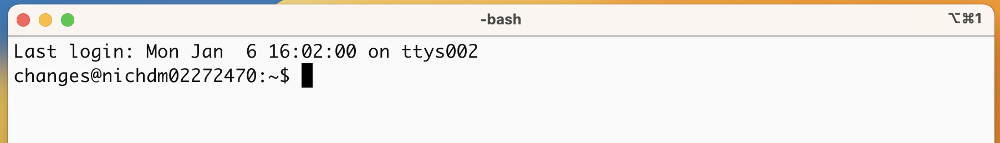

## Learning Objectives

-   Understand why we need to use the command line
-   Log in to a high-performance computing cluster
-   Navigate around the Unix file system
-   Differentiate between full and relative paths
-   List files in a directory
-   Copy, remove and move files

## **What and Why of the Command Line?**

#### What is the command line, anyway?

To put it simply, the command line interface (CLI), is a text-based way of interacting with the operating system of a computer and the files and applications therein. This is in contrast with using a Graphical User Interface (GUI), which may involve the more familiar buttons and menus you are used to.

#### Why use the command line?

-   More direct interface between you and the computer - more streamlined, less tabs and windows open etc. 

-   **Interacting with remote/cloud computer**

-   Many bioinformatics tools are only available, or have more full options, in a command line environment

-   Reusability of your work - can build up to writing scripts that can automate things, or retrieve different things with small modifications 

-   More opportunities in general for batch processing and automations

**Side note:** There are technically mutiple languages with which one could "talk" to their computer on the command line. We are going to use the **Bash** scripting language today, which is extremely common, comes default on most computing systems, and relies on the same principles and highly similar command structure to other command line languages you might encounter. Just an FYI in case I mention "Bash" or if you have heard this term before.

## Setting up

We will spend most of our time learning about the basics of the shell command-line interface (CLI) by exploring experimental data on the **NIH's Biowulf** cluster. So, we will need to log in to this remote compute cluster first before we can start with the basics.

Let's take a quick look at the basic architecture of a cluster environment and some cluster-specific jargon prior to logging in.

<p align="center">


</p>

The above image reflects the many computers that make up a **"cluster"** of computers. Each individual computer in the cluster is usually a lot more powerful than any laptop or desktop computer we are used to working with, and is referred to as a **"node"** (instead of computer). Each node has a designated role, either for logging in or for performing computational analysis/work. **A given cluster will usually have a few login nodes and many compute nodes.**

The data on a cluster is also stored differently than what we are used to with our laptops and desktops, in that it is not computer- or node-specific storage, but all of the data is available to all the nodes in a cluster. This ensures that you don't have to worry about which node is working on your analysis. ***We will be going into more depth about best practices for working on a cluster next week.***

### Logging in to Biowulf

#### Biowulf accounts

For this workshop we will be using your personal Biowulf accounts, which you can log into using your **NIH password**.

#### Tool(s) to access remote computers/clusters

**With Mac OS**

Macs have a utility application called "**Terminal**" for performing tasks on the command line (shell), both locally and on remote machines. We will be using it to log into O2.

Please find and open the Terminal utility on your computers using the *Spotlight Search* at the top right hand corner of your screen.

**With Windows OS**

By default, there is no built-in Terminal that uses the bash shell on the Windows OS. So, we will be using a downloaded program called "**Git BASH**" which is part of the [Git for Windows](https://git-for-windows.github.io/) tool set. **Git BASH is a shell/bash emulator.** What this means is that it shows you a very similar interface to, and provides you the functionality of, the Terminal utility found on the Mac and Linux Operating systems.

If necessary, you should have installed Git BASH prior to the course. Please find and open Git BASH.

#### Let's log in!

Everyone should have their Terminal (or Git BASH Terminal) window open. Using this Terminal window, you can interact with your own computer using bash commands!

You see the "\$" symbol? That is where you write the commands that will be executed by shell (bash in this case) and your computer's kernel. The "\$" is called the **"command prompt"**.

***Please note that from this point on in the workshop anything we want you to type next to the command prompt will be preceded by the `$` (see below). Please make sure you do not type out (or copy and paste) the `$` at the beginning of a command into the Terminal.***




To connect to the login node on Biowulf:

1.  Type in the `ssh` command at the command prompt followed by a space, and then type your username (usually some combo of surname and first name - mine is `changes`) plus the address of the cluster `@biowulf.nih.gov`. There is no space between the username and the "\@" symbol (see below).

``` bash
$ ssh username@biowulf.nih.gov
```

2.  Press the return/enter key and you should receive a prompt for your password. Type in your password and note that **the cursor will not move as you type** it in! This is normal and know that the computer is receiving and transmitting your typed password to the remote system. When you are done typing your password, press Enter again.

3.  If this is the first time you are connecting to the cluster, **a warning will pop up** and will ask you if you are sure you want to do this; **type `Yes` or `Y`**. Once logged in, you should see a bunch of somewhat intimidating information.

And our familiar \$ symbol will return, but this time with your Biowulf username before the prompt. *This is a great way to tell that you are NOT working on your local machine anymore.*

``` bash
username@biowulf:~$ 
```

#### Let's move from the login node to a compute node!

The first command we will run on Biowulf will start a "interactive session". This command will connect us to a compute node, so that all of the commands we run will be processed by a computer designated to do analysis (and not designated to log in users). **Copy and paste the command below.**

``` bash
$ sinteractive
```

Press enter, you should see a couple of messages similar to the following:

```         
salloc: Pending job allocation 44889555
salloc: job 44889555 queued and waiting for resources
salloc: job 44889555 has been allocated resources
salloc: Granted job allocation 44889555
salloc: Nodes cn0011 are ready for job
```

In a few seconds you should get back the command prompt `$`. Now the string of characters before the command prompt will be different. They should say something like `[changes@cn0011:~]`. This is telling you that you are using one of the compute nodes/computer on the cluster now and it is specifying the name of that compute node.

Let's consider the difference between the Login node and a compute node:

**The login node**
The login node (biowulf.nih.gov) is used to submit jobs to the cluster, and is a single system shared by all users. No compute intensive, data transfer or large file manipulation processes should be run on the login node. *This system is for submitting jobs only*.

**The Biowulf cluster (compute nodes)**
The Biowulf cluster is a 95,000+ core/40+ PB Linux cluster, organized into a number of compute nodes optimized for large numbers of high-memory, simultaneous jobs common in the biosciences. When you submit a job script (see next week!) CPUs and memory for a job are dedicated to that job during its walltime and do not compete with other users. `sinteractive` requests a node that we can interact with in real-time, as opposed to running those commands as a job.

**Make sure that your command prompt now contains the word "compute". Once it does, we are ready to copy over some data to work with!**

#### Directories on Biowulf and first commands: `pwd and cd`

Let's see where we've "landed" on Biowulf - That is, figure out what directory we are in. This is important because Bash commands (and indeed, most programming) requires you to know where you are in relation to the files you want to manipulate (more on referring to files later!).

To find out your current position in the Biowulf file system, we can use the `pwd` or **Print Working Directory** command. The term "working directory" is how we refer to the directory we are currently "inside".

``` bash
$ pwd
```

You should see that you are in `/home/$USER.` This is one of two dedicated spaces that you can access by default anywhere on the HPC system. The other is `/data/$USER`.

These two directories have distinct limitations and uses. To quote the [Biowulf storage page](https://hpc.nih.gov/storage/):

**/home**

> Each user has a home directory called /home/username which is accessible from every HPC system. The /home area has a quota of 16 GB which cannot be increased. It is commonly used for config files (aka dotfiles), code, nodes, executables, state files, and caches.

**/data**

> This storage offers high performance access, and is exported to Biowulf over a dedicated high-speed network. /data is accessible from all computational nodes as well as Biowulf and Helix, and will be the storage of choice for most users to store their large datasets. Biowulf users are assigned an initial quota of 100 GB on /data.

**Our course directory**: You will be working in those directories extensively for your own research eventually, but for this course Biowulf staff have set up a shared directory, with a directory for each of you, that gives you access to necessary files and allows the instructor to look into your personal directories for troubleshooting purposes.

For the rest of this lesson, *you will need to be in your personal class directory*: `/data/Bspc-training/$USER`

To move there, we are going to use the `cd` or **Change Directories** command:

``` bash
$ cd /data/Bspc-training/$USER
```

A few things about this command:

-   We are using the full path (i.e. the specific "GPS coordinates") of the folder we are moving into

-   Directory names are case sensitive, so make sure "B" is capitalized

-   `$USER` is a built-in variable on Biowulf that will automatically be interpreted as your username!

-   To check if you successfully moved into the intended directory, you should run `pwd` again.

**It will be helpful to start thinking about directories in a hierarchical way**, so here is a diagram of the directories we've mentioned so far:


Note the distinct \$USER directories with the same name but different locations!

### Setting up data for this lesson:

The first thing to do is to check if there are any files in the data folder we are currently in.

Let's list the contents of our personal class directory using a command called `ls` (**list**), which lists the contents of a directory:

``` bash
$ ls
```

It should show you that you have 0 files, or not show you anything at all because you don't have any data there as of yet!

Let's bring in a data folder from a different location on the cluster to our designated area by using the `cp` (**copy**) command. **Copy and paste the following command** all the way from `cp` and including the period symbol at the end `.`:

``` bash
$ cp -r /data/Bspc-training/shared/rnaseq_jan2025/unix_lesson .
```

To break down this command:

-   You had to specify the location of the item you want to copy

-   You specified the location of the destination - `.` is a shortcut for "here" or your current Working Directory

-   The `-r` is an option that modifies the **cp** command to recursively copy the directory `unix_lesson` AND everything inside of it

Now let's see if we can see this data folder we brought in and if it can be "listed".

``` bash
ls
```

You should see the string of characters "unix_lesson" show up as the output of `ls`. This is a folder we should all have duplicates of.

## Starting with the shell

Let's look at what is inside the data folder and explore further. First, instead of clicking on the folder name to open it and look at its contents, we have to change the folder we are in. When working with any programming tools, **folders are called directories**. We will be using folder and directory interchangeably moving forward.

Let's use the `cd` command again to move into the `unix_lesson` directory:

``` bash
$ cd unix_lesson
```

Did you notice a change in your command prompt? On Biowulf, it by default lists the full path of your current directory, which should now end with `unix_lesson`. This means that our `cd` command ran successfully and we are now *in* the new directory. Let's see what is in here by listing the contents:

``` bash
$ ls
```

You should see:

```         
genomics_data  other  raw_fastq  README.txt  reference_data
```

### Arguments

There are five items listed when you run `ls`, but what types of files are they, or are they directories or files?

We can modify the default behavior of `ls` with one or more **"arguments"** to get more information.

``` bash
$ ls -F

genomics_data/  other/  raw_fastq/  README.txt  reference_data/
```

Anything with a "/" after its name is a directory. Things with an asterisk "\*" after them are programs. If there are no "decorations" after the name, it's a normal text file.

You can also use the argument `-l` to show the directory contents in a long-listing format that provides a lot more information:

``` bash
$ ls -l
```

```         
total 1
drwxrws---+ 2 changes Bspc-training 4096 Jan 13 15:50 genomics_data
drwxrws---+ 2 changes Bspc-training 4096 Jan 13 15:50 other
drwxrws---+ 2 changes Bspc-training 4096 Jan 13 15:50 raw_fastq
-rw-rw----+ 1 changes Bspc-training  377 Jan 13 15:50 README.txt
drwxrws---+ 2 changes Bspc-training 4096 Jan 13 15:50 reference_data
```

Each line of output represents a file or a directory. The directory lines start with `d`. If you want to combine the 2 arguments `-l` and `-F`, you can do so by saying the following:

``` bash
ls -lF
```

Do you see the modification in the output?

<details>

<summary><i>Explanation</i></summary>

<P>
    Notice that the listed directories now have / at the end of their names.
</P>

</details>

> **Tip** - **All commands are essentially programs** that are able to perform specific, commonly-used tasks.

Most commands will take additional arguments that control their behavior, some of them will take a file or directory name as input. How do we know what the available arguments that go with a particular command are? Most commonly used shell commands have a manual available in the shell. You can access the manual using the `man` command. Let's try this command with `ls`:

``` bash
$ man ls
```

This will open the manual page for `ls` and you will lose the command prompt. It will bring you to a so-called "buffer" page, a page you can navigate with your mouse or if you want to use your keyboard we have listed some basic key strokes: \* 'spacebar' to go forward \* 'b' to go backward \* Up or down arrows to go forward or backward, respectively

**To get out of the `man` "buffer" page and to be able to type commands again on the command prompt, press the `q` key!**

------------------------------------------------------------------------

**Exercise 1:**

One useful command is `ls -lrt`. Looking at the `ls` `man` page, how does this modify the output of `ls`? Why might this version of the command be useful?

<details>

<summary><i>Explanation</i></summary>

<P> `-l`is the same long-format flag as before. `-r` sorts the contents in reverse order, specifically by time `-t` </P>

</details>

**Exercise 2:**

-   Open up the manual page for the `find` command. Skim through some of the information.
    -   Do you think you might be able to learn this much information about many commands by heart?
    -   Do you think this format of information display is useful for you?
-   Quit the `man` buffer and come back to your command prompt.

> **Tip** - Shell commands can get extremely complicated. No one can possibly learn all of these arguments, of course. So you will probably find yourself referring to the manual page frequently.
>
> **Tip** - If the manual page within the Terminal is hard to read and traverse, the manual exists online too. Use your web searching powers to get it! In addition to the arguments, you can also find good examples online; ***Google is your friend.***

------------------------------------------------------------------------

## The Unix directory file structure (a.k.a. where am I?)

Let's practice moving around a bit. Let's go into the raw_fastq directory and see what is in there.

``` bash
$ cd raw_fastq/

$ ls -l
```

Great, we have now traversed some sub-directories, but where are we in the context of our pre-designated "home" directory that contains the `unix_lesson` directory?!

### The "root" directory!

Like on any computer you have used before, the file structure within a Unix/Linux system is hierarchical, like an upside down tree with the "/" directory, called "root" as the starting point of this tree-like structure:

<p align="center">
    


</p>

> **Tip** - Yes, the root folder's actual name is just **`/`** (a forward slash).

That `/` or root is the 'top' level.

When you log in to a remote computer you land on one of the branches of that tree, i.e. your pre-designated "home" directory that usually has your login name as its name (e.g. `/home/changes`).

> **Tip** - On mac OS, which is a UNIX-based OS, the root level is also "/".
>
> **Tip** - On a windows OS, it is drive specific; "C:" is considered the default root, but it changes to "D:/", if you are on that drive.

### Paths

Now let's learn more about the "addresses" of directories, called **"path"** and move around the file system.

Let's check to see what directory we are in. The command prompt tells us which directory we are in, but it doesn't give information about where the `raw_fastq` directory is with respect to our "home" directory or the `/` directory.

The command to check our current location is `pwd`, this command does not take any arguments and it returns the path or address of your **p**resent **w**orking **d**irectory (the folder you are in currently).

``` bash
$ pwd
```

In the output here, each folder is separated from its "parent" or "child" folder by a "/", and the output starts with the root `/` directory. So, you are now able to determine the location of `raw_fastq` directory relative to the root directory!

But which is your pre-designated home folder? No matter where you have navigated to in the file system, just typing in `cd` will bring you to your home directory.

``` bash
$ cd
```

What is your present working directory now?

``` bash
$ pwd
```

This should now display a shorter string of directories starting with root. This is the full address to your home directory, also referred to as "**full path**". **The "full" here refers to the fact that the path starts with the root, which means you know which branch of the tree you are on in reference to the root.**

#### A note about your /home directory 

Since we are NOT working from your /home directory, this is not relevant at the moment, but still very useful to know. Take a look at your command prompt now, does it show you the name of this directory (your username?)?

*No, it doesn't. Instead of the directory name it shows you a `~`.*

Why is this so?

*This is because `~` = full path to home directory for the user.*

Can we just type `~` instead of `/home/username`?

*Yes, we can!*

#### Using full paths with commands

You can do a lot more with the idea of stringing together *parent/child* directories. Let's say we want to look at the contents of the `raw_fastq` folder, but do it from our main course directory (`/data/Bspc-training/$USER` ). We can use the list command and follow it up with the path to the folder we want to list!

``` bash
$ cd /data/Bspc-training/$USER

$ ls -l /data/Bspc-training/$USER/unix_lesson/raw_fastq
```

Now, what if we wanted to change directories to `raw_fastq` in a single step?

``` bash
$ cd /data/Bspc-training/$USER/unix_lesson/raw_fastq
```

Voila! You have moved 2 levels of directories in one command.

What if we want to move back up and out of the `raw_fastq` directory? Can we just type `cd unix_lesson`? Try it and see what happens.

*Unfortunately, that won't work because when you say `cd unix_lesson`, shell is looking for a folder called `unix_lesson` within your current directory, i.e. `raw_fastq`.*

Can you think of an alternative?

*You can use the full path to unix_lesson!*

``` bash
$ cd /data/Bspc-training/$USER/unix_lesson/
```

> **Tip** What if we want to navigate to the previous folder but can't quite remember the full or relative path, or want to get there quickly without typing a lot? In this case, we can use `cd -`. When `-` is used in this context it is referring to a special variable called `$OLDPWD` that is stored without our having to assign it anything. We'll learn more about variables in a future lesson, but for now you can see how this command works. Try typing:
>
> ``` bash
> cd -
> ```
>
> This command will move you to the last folder you were in before your current location, then display where you now are! If you followed the steps up until this point it will have moved you back to the `unix_lesson` directory.

------------------------------------------------------------------------

**Exercises**

1.  From your main course directory, list the contents of the `reference_data` directory that is within the `unix_lesson` directory. What command did you use?

------------------------------------------------------------------------

#### Tab completion

Typing out full directory names can be time-consuming and error-prone. One way to avoid that is to use **tab completion**. The `tab` key is located on the left side of your keyboard, right above the `caps lock` key. When you start typing out the first few characters of a directory name, then hit the `tab` key, Shell will try to fill in the rest of the directory name.

For example, first type `cd` to get back to your home directly, then type `cd uni`, followed by pressing the `tab` key:

``` bash
$ cd
$ cd uni<tab>
```

The shell will fill in the rest of the directory name for `unix_lesson`.

Now, let's go into `raw_fastq`, then type `ls Mov10_oe_`, followed by pressing the `tab` key once:

``` bash
$ cd raw_fastq/
$ ls Mov10_oe_<tab>
```

**Nothing happens!!**

The reason is that there are multiple files in the `raw_fastq` directory that start with `Mov10_oe_`. As a result, shell does not know which one to fill in. When you hit `tab` a second time again, the shell will then list all the possible choices.

``` bash
$ ls Mov10_oe_<tab><tab>
```

Now you can select the one you are interested in listed, and enter the number and hit tab again to fill in the complete name of the file.

``` bash
$ ls Mov10_oe_1<tab>
```

> **NOTE:** Tab completion can also fill in the names of commands. For example, enter `e<tab><tab>`. You will see the name of every command that starts with an `e`. One of those is `echo`. If you enter `ech<tab>`, you will see that tab completion works.

**Tab completion is your friend!** It helps prevent spelling mistakes, and speeds up the process of typing in the full command. We encourage you to use this when working on the command line.

#### Relative paths

We have talked about **full** paths so far, but there is a way to specify paths to folders and files without having to worry about the root directory. And you have used this before when we were learning about the `cd` command.

Let's change directories back to your course directory, and once more change directories to `raw_fastq` in a single step. (*Feel free to use your tab-completion to complete your path!*)

``` bash
$ cd /data/Bspc-training/$USER/
```

``` bash
$ cd unix_lesson/raw_fastq
```

This time we are not using the `/data/Bspc-training/$USER` before `unix_lesson`. In this case we are using a relative path, relative to our current location - wherein we know that `unix_lesson` is a child folder in our home folder, and the `raw_fastq` folder is within `unix_lesson`.

There is also a handy shortcut for the relative path to a parent directory, 2 periods `..`. Let's say we wanted to move from the `raw_fastq` folder to its parent folder.

``` bash
cd ..
```

You should now be in the `unix_lesson` directory (check command prompt or run `pwd`).

> Can you think of an example when this shortcut to the parent directory won't work?
>
> <details>
>
> <summary>Answer</summary>
>
> <P>When you are at the root directory, since there is no parent to the root directory!</P>
>
> </details>

When using relative paths, you might need to check what the branches are downstream of the folder you are in. There is a really handy command (`tree`) that can help you see the structure of any directory.

``` bash
$ tree
```

For example, the output of `tree` from within `unix data` looks like this:

```         
├── genomics_data
│   ├── Encode-hesc-Nanog.bed
│   └── na12878_q20_annot.vcf
├── other
│   ├── Mov10_rnaseq_metadata.txt
│   └── sequences.fa
├── raw_fastq
│   ├── Irrel_kd_1.subset.fq
│   ├── Irrel_kd_2.subset.fq
│   ├── Irrel_kd_3.subset.fq
│   ├── Mov10_oe_1.subset.fq
│   ├── Mov10_oe_2.subset.fq
│   └── Mov10_oe_3.subset.fq
├── README.txt
└── reference_data
    ├── chr1.fa
    └── chr1-hg19_genes.gtf

4 directories, 13 files
```

If you are aware of the directory structure, you can string together as long a list of directories as you like using either **relative** or **full** paths.

#### Synopsis of Full versus Relative paths

**A full path always starts with a `/`, a relative path does not.**

A relative path is like getting directions from someone on the street. They tell you to "go right at the Stop sign, and then turn left on Main Street". That works great if you're standing there together, but not so well if you're trying to tell someone how to get there from another country. A full path is like GPS coordinates. It tells you exactly where something is no matter where you are right now.

You can usually use either a full path or a relative path depending on what is most convenient. If we are in the home directory, it is more convenient to just enter the relative path since it involves less typing.

Over time, it will become easier for you to keep a mental note of the structure of the directories that you are using and how to quickly navigate among them.

## Copying, creating, moving and removing data

Now we can move around within the directory structure using the command line. But what if we want to do things like copy files or move them from one directory to another, rename them?

Let's move into the `raw_fastq` directory, this contains some fastq files which are the output of sequencing.

``` bash
cd unix_lesson/raw_fastq
```

> **Tip** - These files are referred to as "raw" data since it has not been changed or analyzed after being generated.

### Copying

Let's use the copy (`cp`) command to make a copy of one of the files in this folder, `Mov10_oe_1.subset.fq`, and call the copied file `Mov10_oe_1.subset-copy.fq`. The copy command has the following syntax:

`cp  path/to/item-being-copied  path/to/new-copied-item`

In this case the files are in our current directory, so we just have to specify the name of the file being copied, followed by whatever we want to call the newly copied file.

``` bash
$ cp Mov10_oe_1.subset.fq Mov10_oe_1.subset-copy.fq

$ ls -l
```

The copy command can also be used for copying over whole directories, but the `-r` argument has to be added after the `cp` command. The `-r` stands for "recursively copy everything from the directory and its sub-directories". [We used it earlier when we copied over the `unix_lesson` directory to our home directories](#copying-example-data-folder).

### Creating

Next, let's create a directory called `fastq_backup` and we can move the copy of the fastq file into that directory.

The `mkdir` command is used to make a directory, syntax: `mkdir  name-of-folder-to-be-created`.

``` bash
$ mkdir fastq_backup
```

> **Tip** - File/directory/program names with spaces in them do not work well in Unix, use characters like hyphens or underscores instead. Using underscores instead of spaces is called "snake_case". Alternatively, some people choose to skip spaces and rather just capitalize the first letter of each new word (i.e. MyNewFile). This alternative technique is called "CamelCase".

### Moving

We can now move our copied fastq file in to the new directory. We can move files around using the move command, `mv`, syntax:

`mv  path/to/item-being-moved  path/to/destination`

In this case we can use relative paths and just type the name of the file and folder.

``` bash
$ mv  Mov10_oe_1.subset-copy.fq  fastq_backup
```

Let's check if the move command worked like we wanted:

``` bash
$ ls -l fastq_backup
```

### Renaming

The `mv` command has a second functionality, it is what you would use to rename files too. The syntax is identical to when we used `mv` for moving, but this time instead of giving a directory as its destination, we just give a new name as its destination.

Let's try out this functionality!

The name Mov10_oe_1.subset-copy.fq is not very informative, we want to make sure that we have the word "backup" in it so we don't accidentally delete it.

``` bash
$ cd fastq_backup

$ mv  Mov10_oe_1.subset-copy.fq   Mov10_oe_1.subset-backup.fq

$ ls
```

> **Tip** - You can use move to move a file and rename it at the same time!

**Important notes about `mv`**: \* When using `mv`, shell will **not** ask if you are sure that you want to "replace existing file" or similar unless you use the -i option. \* Once replaced, it is not possible to get the replaced file back!

### Removing

We find out that we did not need to create backups of our fastq files manually as backups were generated by our collaborator; in the interest of saving space on the cluster, we want to delete the contents of the `fastq-backup` folder and the folder itself.

``` bash
$ rm  Mov10_oe_1.subset-backup.fq
```

Important notes about `rm` \* `rm` permanently removes/deletes the file/folder. \* There is no concept of "Trash" or "Recycle Bin" on the command-line. When you use `rm` to remove/delete they're really gone. \* **Be careful with this command!** \* You can use the `-i` argument if you want it to ask before removing, `rm -i file-name`.

Let's delete the fastq_backup folder too. First, we'll have to navigate our way to the parent directory (we can't delete the folder we are currently in/using).

``` bash
$ cd ..

$ rm  fastq_backup 
```

Did that work? Did you get an error?

<details>

<summary><i>Explanation</i></summary>

<P>By default, <code>rm</code>, will NOT delete directories, but you use the <code>-r</code> flag if you are sure that you want to delete the directories and everything within them. To be safe, let's use it with the <code>-i</code> flag.</P>

</details>

<br>

``` bash
$ rm -ri fastq_backup
```

-   `-r`: recursive, commonly used as an option when working with directories, e.g. with `cp`.
-   `-i`: prompt before every removal.

------------------------------------------------------------------------

**Exercise**

1.  Create a new folder in `unix_lesson` called `selected_fastq`
2.  Copy over the Irrel_kd_2.subset.fq and Mov10_oe_2.subset.fq from `raw_fastq` to the `/unix_lesson/selected_fastq` folder
3.  Rename the `selected_fastq` folder and call it `exercise1`

------------------------------------------------------------------------

## Exiting from the cluster

To close the interactive session on the cluser as well as to disconnect from the cluster, the command is `exit`. So, you are going to have to run the exit command twice.

```         
changes@cn4289:/data/Bspc-training/changes/unix_lesson/raw_fastq/fastq_backup$ exit
salloc: Relinquishing job allocation 45051688

changes@biowulf:$ exit
logout
Connection to biowulf.nih.gov closed.
changes@nichdm02272470:~$
```

## Commands

```         
cd          # change directory
ls          # list contents
man         # manual for a command
pwd         # check present working directory
tree        # prints a tree of the file structure
cp          # copy
mkdir       # make new directory
mv          # move or rename 
rm          # remove/delete
```

## Shortcuts

```         
~           # home directory
/           # root directory
.           # current directory
..          # parent directory
```

------------------------------------------------------------------------

*This lesson was based on materials from the [Harvard Chan Bioinformatics Core (HBC)](http://bioinformatics.sph.harvard.edu/). These are open access materials distributed under the terms of the [Creative Commons Attribution license](https://creativecommons.org/licenses/by/4.0/) (CC BY 4.0), which permits unrestricted use, distribution, and reproduction in any medium, provided the original author and source are credited.*

-   *The materials used in this lesson were derived from work that is Copyright © Data Carpentry (<http://datacarpentry.org/>). All Data Carpentry instructional material is made available under the [Creative Commons Attribution license](https://creativecommons.org/licenses/by/4.0/) (CC BY 4.0).*
-   *Adapted from the lesson by Tracy Teal. Original contributors: Paul Wilson, Milad Fatenejad, Sasha Wood and Radhika Khetani for Software Carpentry (<http://software-carpentry.org/>)*
