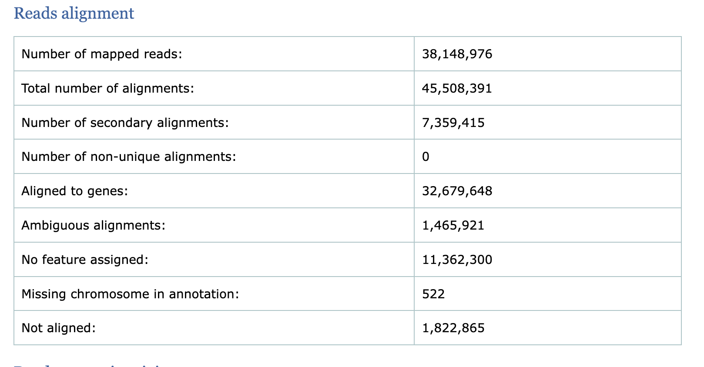
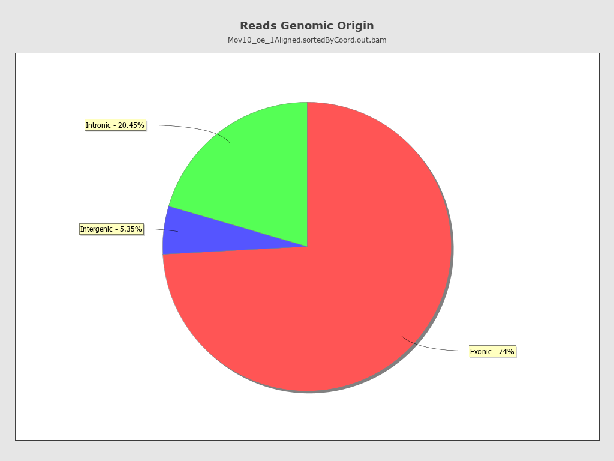
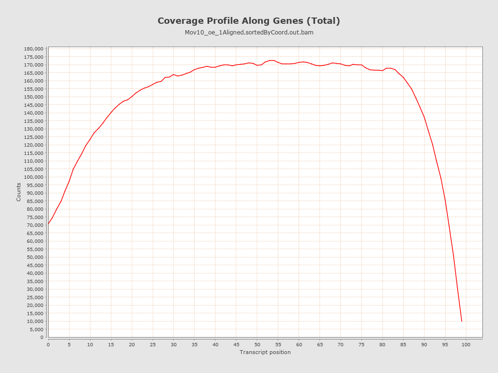
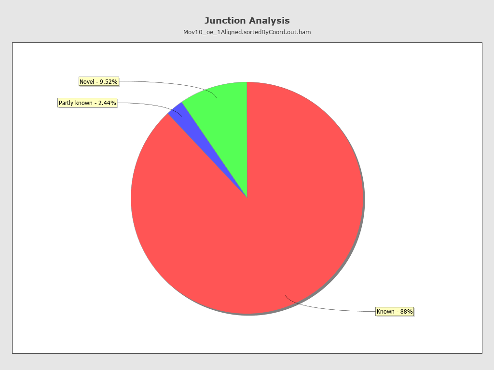

Approximate time: 45 minutes

## Learning Objectives:

-   Brief explanation about SAM file
-   Running an alignment tool to generate BAM files
-   Running Qualimap to compute metrics on alignment files

## Aligning Reads to a Genome

**In order for us to test for differential expression we need to gain information we will gain genomic coordinate information for where each read maps** by aligning it to the reference genome to produce a BAM file. We will also **assess the quality of the mapping** by using the BAM file as input to a tool called [Qualimap](http://qualimap.bioinfo.cipf.es/doc_html/intro.html) which computes various quality metrics such as DNA or rRNA contamination, 5'-3' biases, and coverage biases.

To determine where on the human genome our reads originated from, we will align our reads to the reference genome using [STAR](http://www.ncbi.nlm.nih.gov/pmc/articles/PMC3530905/) (Spliced Transcripts Alignment to a Reference). STAR is an aligner designed to specifically address many of the challenges of RNA-seq data mapping using a strategy to account for spliced alignments.

## Alignment file format: SAM/BAM

The **Sequence Alignment Map format** (SAM) file is **a tab-delimited text file that contains all information from the FASTQ file, with additional fields containing alignment information for each read**. Specifically, we can obtain the genomic coordinates of where each read maps to in the genome and the quality of that mapping. A **BAM file is the binary, compressed version of the SAM file**. It is significantly smaller in size and is usually the file format requested for by downstream tools that require alignment data as input. The paper by [Heng Li et al](http://bioinformatics.oxfordjournals.org/content/25/16/2078.full) provides a lot more detail on the specification, and we will go into detail in the next lesson about how to work with SAM/BAM files.


## In Brief: STAR Alignment Strategy

STAR is shown to have high accuracy and outperforms other aligners by more than a factor of 50 in mapping speed (depending on the comparison done), but it is memory intensive. The algorithm achieves this highly efficient mapping by performing a two-step process:

1.  Seed searching
2.  Clustering, stitching, and scoring

#### Seed searching

For every read that STAR aligns, STAR will search for the longest sequence that exactly matches one or more locations on the reference genome. These longest matching sequences are called the Maximal Mappable Prefixes (MMPs):

{alt="STAR_step1"}

The different parts of the read that are mapped separately are called 'seeds'. So the first MMP that is mapped to the genome is called *seed1*.

STAR will then search again for only the unmapped portion of the read to find the next longest sequence that exactly matches the reference genome, or the next MMP, which will be *seed2*.

{alt="STAR_step2"}

This sequential searching of only the unmapped portions of reads underlies the efficiency of the STAR algorithm. STAR uses an uncompressed suffix array (SA) to efficiently search for the MMPs, this allows for quick searching against even the largest reference genomes. Other slower aligners use algorithms that often search for the entire read sequence before splitting reads and performing iterative rounds of mapping.

**If STAR does not find an exact matching sequence** for each part of the read due to mismatches or indels, the previous MMPs will be extended.


**If extension does not give a good alignment**, then the poor quality or adapter sequence (or other contaminating sequence) will be soft clipped.


When aligning reads yourself, you don't need to know all of these details -- it's just good to have a sense of what is going on when running a tool!

#### Clustering, stitching, and scoring

The separate seeds are stitched together to create a complete read by first clustering the seeds together based on proximity to a set of 'anchor' seeds, or seeds that are not multi-mapping.

Then the seeds are stitched together based on the best alignment for the read (scoring based on mismatches, indels, gaps, etc.).


## Aligning reads: Interactive

Since we already have the reference index ready, we can move on to aligning reads to the genome.

First, we can open another interactive session. Note that we are requesting a good deal more memory (24 GB), and CPUS (12). Mapping reads to a big, eukaryotic genome consumes lots of memory because the index needs to be loaded into memory.

We are also adding a new parameter: `gres=lscratch:1`.

``` bash
$ sinteractive --cpus-per-task=12 --mem=24g --gres=lscratch:1
```

Each Biowulf node has a directly attached disk containing a `lscratch` filesystem which is intended to be used as ephemeral, temporary space just for the duration of a job. Note that this space is not backed up, and thus, users should use it only as temporary space while running a job. Once the job exits, you will no longer have access to `/lscratch` on the node. See [Using Local Disk](https://hpc.nih.gov/docs/userguide.html#local) in the Biowulf User Guide for more info.

It is recommended that you allocate 6x the compressed input fastq size of lscratch if we are producing a sorted BAM file (see below). More details about running STAR on Biowulf can be found on the [Biowulf STAR software page](https://hpc.nih.gov/apps/STAR.html).

``` bash
# Double-checking the size of the FASTQ input file. It is 73MB. I rounded up from 73MB*6 to set our lscratch to roughly 1GB. 
ls -lh /data/BSPC-training/$USER/rnaseq/raw_data/Mov10_oe_1.subset.fq
```

Next, move into our `rnaseq` directory and create an output directory for our alignment files:

``` bash
$ cd /data/Bspc-training/$USER/rnaseq

$ mkdir results/STAR
```

For now, we're going to work on just one sample to set up our workflow. To start we will use the first replicate in the Mov10 over-expression group, `Mov10_oe_1.subset.fq`. Details on STAR and its functionality can be found in the [user manual](https://raw.githubusercontent.com/alexdobin/STAR/master/doc/STARmanual.pdf); we encourage you to peruse through to get familiar with all available options. Warning, it's 63 pages!

The basic options for aligning reads to the genome using STAR are:

-   `--runThreadN`: number of threads / cores
-   `--readFilesIn`: /path/to/FASTQ_file
-   `--genomeDir`: /path/to/genome_indices_directory
-   `--outFileNamePrefix`: prefix for all output files

Listed below are additional parameters that we will use in our command:

-   `--outSAMtype`: output filetype (SAM default), but also produce a BAM that has been sorted by genomic coordinates, which is what will be needed for downstream analyses.
-   `--outSAMunmapped`: what to do with unmapped reads

> **NOTE:** Note that "**STAR’s default parameters are optimized for mammalian genomes.** Other species may require significant modifications of some alignment parameters; in particular, the maximum and minimum intron sizes have to be reduced for organisms with smaller introns" [[1](http://bioinformatics.oxfordjournals.org/content/early/2012/10/25/bioinformatics.bts635.full.pdf+html)].

Section 3.3.2 of the STAR manual lists options that the ENCODE consortium has used:

```bash
--outFilterType BySJout     # reduces the number of 'spurious' junctions
--outFilterMultimapNmax 20  # max number of multiple alignments allowed for a read: if exceeded, the read is considered unmapped
--alignSJoverhangMin 8      # minimum overhang for unannotated junctions
--alignSJDBoverhangMin 1    # minimum overhang for annotated junctions
--outFilterMismatchNmax 999 # maximum number of mismatches per pair, large number switches off this filter
--outFilterMismatchNoverReadLmax 0.04 # max number of mismatches per pair relative to read length: for 2x100b, max number of mismatches is 0.04*200=8 for the paired read
--alignIntronMin 20         # minimum intron length
--alignIntronMax 1000000    # maximum intron length
--alignMatesGapMax 1000000  # maximum genomic distance between mates
```

The full command is provided below for you to copy paste into your terminal. If you want to manually enter the command, it is advisable to first type out the full command in a on your local machine and then copy paste into the terminal. This will make it easier to catch typos and make appropriate changes. You can also use `vim` to write this in a text file. You can run the script on the interactive node, and once you're convinced that it runs well on example data, you can just change the filename to the full-size data and submit the job with `sbatch`

``` bash
# assumes you are in raw_data directory
$ STAR --genomeDir /data/Bspc-training/shared/rnaseq_jan2025/human_GRCh38 --runThreadN 10 --readFilesIn Mov10_oe_1.subset.fq --outFileNamePrefix ../results/STAR/Mov10_oe_1_subset --outSAMtype BAM SortedByCoordinate --outSAMunmapped Within --outSAMattributes Standard 
```

Mapping the full, non-subsetted samples will take much more time, so this is a good use case for submitting an SBATCH script.

#### STAR output

After running our single FASTQ file through the STAR aligner, you should have a number of output files in your `/rnaseq/results/STAR` directory. Let's take a quick look at some of the files that were generated and explore their content.

``` bash
$ cd ../rnaseq/results/STAR

$ ls -lh
```

You should have **5 output files** plus a single `.tmp` directory for the Mov10_oe_1 sample. The contents of the 5 files are described below:

-   `Log.final.out` - a summary of mapping statistics for the sample
-   `Aligned.sortedByCoord.out.bam` - the aligned reads, sorted by coordinate, in BAM format
-   `Log.out` - a running log from STAR, with information about the run
-   `Log.progress.out` - job progress with the number of processed reads, % of mapped reads etc., updated every \~1 minute
-   `SJ.out.tab` - high confidence collapsed splice junctions in tab-delimited format. Only junctions supported by uniquely mapping reads are reported

> NOTE: For any tool you run, you should get into the habit of seeing what it creates. Use `less`, `grep`, and other commands you've learned to inspect the output. Often there is all sorts of interesting information in there that may not be otherwise documented anywhere.

## Mapping statistics

Having completed the alignment, the first thing we want to know is how well did our reads align to the reference. Rather than looking at each read alignment, it can be more useful to evaluate statistics that give a general overview for the sample. One of the output files from the STAR aligner contains mapping statistics, let's take a closer look at one of those files. We'll use the `less` command which allows us to scroll through it easily:

```         
$ less Mov10_oe_1_Log.final.out
```

The log file provides information on reads that 1) mapped uniquely, 2) reads that mapped to mutliple locations and 3) reads that are unmapped. Additionally, we get details on splicing, insertion and deletion. From this file the most informative statistics include the **mapping rate and the number of multimappers**.

-   As an example, a good quality sample will have **at least 75% of the reads uniquely mapped**. Once values start to drop lower than 60% it's advisable to start troubleshooting. The lower the number of uniquely mapping reads means the higher the number of reads that are mapping to multiple locations. It is best to keep this number low because multi-mappers are not included when we start counting reads

> NOTE: The thresholds suggested above will vary depending on the organism that you are working with. Much of what is discussed here is in the context of working with human or mouse data. For example, 75% of mapped reads holds true only if the genome is good or mature. For badly assembled genomes we may not observe a high mapping rate, even if the actual sequence sample is good.

> NOTE: **multimappers** are reads that could have come from multiple places in the genome, but we don't have enough information to know for sure. For example, reads coming from repetitive elements will be multimapping. Other examples are gene duplication events (like the [teleost fish duplication event](https://pubmed.ncbi.nlm.nih.gov/25092473/) that you'll need to consider if working with zebrafish) or similar genes (like the collagen or tubulin families). It's possible that increasing the read length would allow us to identify a unique mapping location, but not always.


------------------------------------------------------------------------

**Exercise**

Using the less command take a look at `Mov10_oe_1_Log.final.out` and answer the following questions:

1.  How many reads map to more than 10 locations on the genome?
2.  How many reads are unmapped due to read length?
3.  What is the average mapped length per read?

**We are most interested in the BAM file, which will allow us to proceed with Qualimap.**

### Running Qualimap

Alignment data files frequently contain biases that are introduced by sequencing technologies and/or during sample preparation. Therefore, one of the fundamental requirement during analysis of these data is to perform quality control. In this way, we get an idea of **how well our reads align to the reference** and **how well data fit with the expected outcome**.

We *could* take the BAM file we generated in the previous step and use it as input to Qualimap which computes various quality metrics such as DNA or rRNA contamination, 5'-3' biases, and coverage biases.

To **run Qualimap**, change directories to the `rnaseq` folder and make a `qualimap` folder inside the `results` directory:

``` bash
$ cd /data/Bspc-training/$USER/rnaseq #if you aren't already there 

$ mkdir -p results/qualimap #check out mkdir's man page. What does -p do? 
```

By default, Qualimap will try to open a GUI (graphical user interface) to run Qualimap, so we need to run the `unset DISPLAY` command:

``` bash
$ unset DISPLAY
```

> NOTE: technically, `$DISPLAY` is an environment variable like `$USER` or `$PATH`. Unsetting it (and referring to the name of the variable without the `$`) makes it go away. Turns out `qualimap` looks for this variable to decide wther to run in GUI mode.

We also need to load the qualimap module:

``` bash
$ module load qualimap/2.2.1
```

Now we are ready to run Qualimap on our BAM file! There are different tools or modules available through Qualimap, and the [documentation website](http://qualimap.bioinfo.cipf.es/doc_html/command_line.html) details the tools and options available. We are interested in the `rnaseq` tool. To see the arguments available for this tool we can look at `help`.

``` bash
$ qualimap rnaseq 
```

We will be running Qualimap with the following specifications:

-   `-outdir`: output directory for html report
-   `-a`: Counting algorithm - uniquely-mapped-reads(default) or proportional (each multi-mapped read is weighted according to the number of mapped locations)
-   `-bam`: path/to/bam/file(s)
-   `-p`: Sequencing library protocol - strand-specific-forward, strand-specific-reverse or non-strand-specific (default)
-   `-gtf`: path/to/gtf/file - **needs to match the genome build and GTF used in alignment**
-   `--java-mem-size=`: set Java memory

``` bash
# assuming you are running the script from /results - change directory to get there, if needed 
qualimap rnaseq -outdir qualimap/Mov10_oe_1 -a proportional -bam STAR/Mov10_oe_1_Aligned.sortedByCoord.out.bam -p strand-specific-reverse -gtf /data/Bspc-training/shared/rnaseq_jan2025/human_GRCh38/gencode.v47.primary_assembly.annotation.gtf --java-mem-size=8G
```

> NOTE: Notice the arguments to qualimap always use a *single* `-` (e.g., `-outdir`) unlike STAR which used *two* (e.g., `--outFileNamePrefix`). Not really any reason for this, just tool author preferences. You should always read the manual to know how to specify arguments.

> NOTE: Read the qualimap help for the version you're using. The best way to do this is to read the command-line help. Websites are convenient to read, but they may not match what you're actually running.

### The Qualimap report

The Qualimap report in HTML format should be present in the `results/qualimap` directory. To view this report you need a web browser, so you would need to transfer it over to your laptop. You can do so by Connecting to Server again or using `scp`. **But as we saw with our FASTQC exercise, calculating these for the small subset is not representative of our whole library, so we are going to walk through these results for a full sample. You can open up the [full HTML report](../data/Mov10_oe1_full_qualimapReport.html).**

#### **Read alignment summary**

The first few numbers listed in the report are the mapping statistics. Qualimap also computes counts by assigning reads to genes and [reports associated statistics](http://qualimap.conesalab.org/doc_html/analysis.html#id7). For example it computes the following:

-   the number of reads aligned to genes

-   number of ambiguous alignments (reads matching several genes)

-   number of alignments without any feature (intronic and intergenic)



> -   The percentage of mapped reads is a global indicator of the overall sequencing accuracy. We expect between 70-90% of reads to be mapped for the human genome.
> -   Expect a small fraction of reads to be mapping equally well to multiple regions in the genome (‘multi-mapping reads’).

#### **Genomic Origin of Reads: Exon, Intron or Intergenic Region?**

This section reports how many alignments fall into exonic, intronic and intergenic regions along with a number of intronic/intergenic alignments overlapping exons. Exonic region includes 5’UTR,protein coding region and 3’UTR region. This information is summarized in table in addition to a pie chart as shown below.



> -   Even if you have high genomic mapping rate for all samples, check to see where the reads are mapping. Expect a high proportion of reads mapping to exonic regions (\> 60%) and lower intronic mapping rates (20 -30%).
> -   A higher intronic mapping rate is expected for rRNA removal compared to polyA selection. The intronic reads likely originate from immature transcripts which include either full-length pre-mRNA molecules or nascent transcripts where the RNA polymerase has not yet attached to the 3′ end of the gene.
> -   A roughly equal distribution of reads mapping to intronic, exonic and intergenic regions suggests that there is DNA contamination.
> -   Ribosomal RNA (rRNA) constitutes a large majority of the RNA species in any total RNA preparation. Despite depletion methods, you can never achieve complete rRNA removal. Even with Poly-A enrichment a small percentage of ribosomal RNA can stick to the enrichment beads non-specifically. Excess ribosomal content (\> 2%) will normally have to be filtered out so that differences in rRNA mapped reads across samples do not affect alignment rates and skew subsequent normalization of the data.

#### **Transcript coverage profile**

The profile provides ratios between mean coverage at the 5’ region, the 3’ region and the whole transcript. Coverage plots are generated for all genes total, and also for the 500 highest-expressed and 500 lowest-expressed genes separately.

-   **5’ bias**: the ratio between mean coverage at the 5’ region (first 100bp) and the whole transcript
-   **3’ bias**: is the ratio between mean coverage at the 3’ region (last 100bp) and the whole transcript
-   **5’-3’ bias**: is the ratio between both biases.

|            |      |
|------------|------|
| 5' bias    | 0.7  |
| 3' bias    | 0.59 |
| 5'-3' bias | 1.01 |




> -   In a perfect sequencing experiment you would expect to see a 5'-3' bias ratio of 1 with low coverage at both ends of the transcript. This would suggest no bias is present.
> -   It is well-documented that libraries prepared with polyA selection can lead to high expression in 3' region (3' bias). At least [one study](https://genomebiology.biomedcentral.com/articles/10.1186/gb-2014-15-6-r86) shows the reverse effect for rRNA removal.
> -   If reads primarily accumulate at the 3’ end of transcripts in poly(A)-selected samples, this might indicate low RNA quality in the starting material.

#### **Junction Analysis**

Qualimap also reports the total number of reads mapping to splice junctions and the 10 most frequent junction rates. The pie chart shows analysis of junction positions in spliced alignments.

-   Known category represents percentage of alignments where both junction sides are known.
-   Partly known represents alignments where only one junction side is known.
-   All other alignments with junctions are marked as Novel.





> Other tools like [RNASeQC](https://software.broadinstitute.org/cancer/cga/rna-seqc) will plot figures that can help evaluate **GC content bias**. This is also an important aspect of QC, as low/high GC content regions will tend to have low coverage.

------------------------------------------------------------------------

## Summary

Taken together, these metrics give us some insight into the quality of our samples and help us in identifying any biases present in our data. The conclusions derived from these QC results may indicate that we need to correct for these biases by changing mapping parameters for performing other analyses.

------------------------------------------------------------------------

## Assignment

Copy and paste and then use VIM to modify the following script template to map the full `/data/Bspc-training/shared/rnaseq_jan2025/Irrel_kd_1.fq` sample as if you were running it from your `/scripts` directory. Save it in `/scripts` as `Irrel_kd_1_STAR.sh` . *This will require you to convert some aspects of our interactive STAR command to a SBATCH script - a very common task in bioinformatics when we want to scale something up!*

Let me know when this is ready but **DO NOT RUN THIS, we don't have space for everyone to have full-sized BAM files - I have them pre-generated for other analyses - this is to have you practice choosing these mapping parameters.**

``` bash
#!/bin/bash
#SBATCH --gres=lscratch: #designate lscratch space based on size of input FASTQ file
#SBATCH --partition=quick
#SBATCH --time=3:00:00     # time limit
#SBATCH --cpus-per-task=       # number of cores
#SBATCH --mem=   # requested memory
#SBATCH --job-name salmon_in_serial      # Job name
#SBATCH -o .out           # File to which standard output will be written
#SBATCH -e .err       # File to which standard error will be written
#SBATCH --mail-type=BEGIN,END

# Load STAR same star version we used above
module load 

# Fill in the blanks! 
STAR --genomeDir --runThreadN --readFilesIn --outFileNamePrefix --outSAMtype BAM SortedByCoordinate --outSAMunmapped Within --outSAMattributes Standard --outTmpDir=/lscratch/$SLURM_JOB_ID/STARtmp
```

**Some hints:**

-   `--outTmpDir=/lscratch/$SLURM_JOB_ID/STARtmp` is already set for you, so you don't need to modify this. You may want to check out the STAR Biowulf page to understand what this is doing.

-   Make sure there is a relationship between the number of CPUs you request and the number of actual threads you set.
