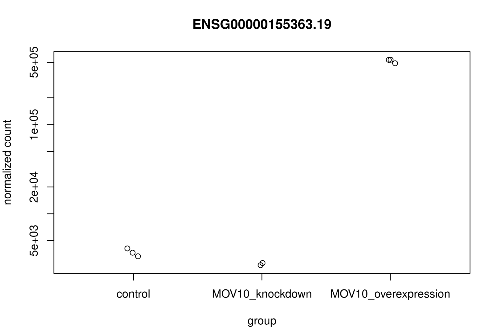
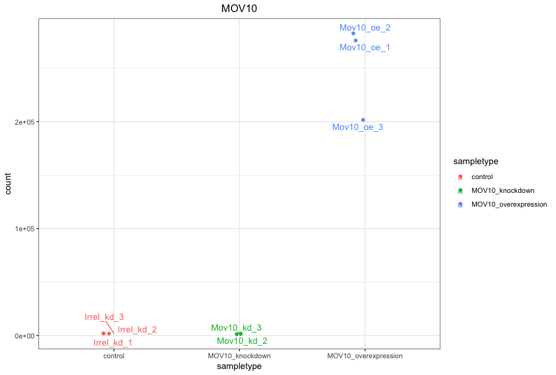
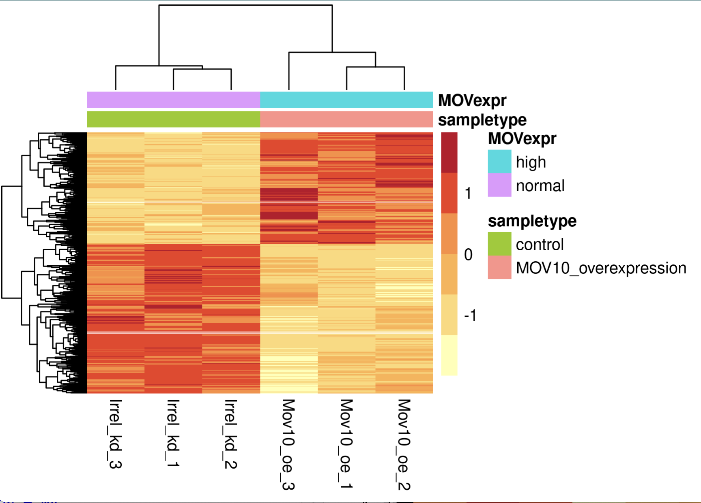
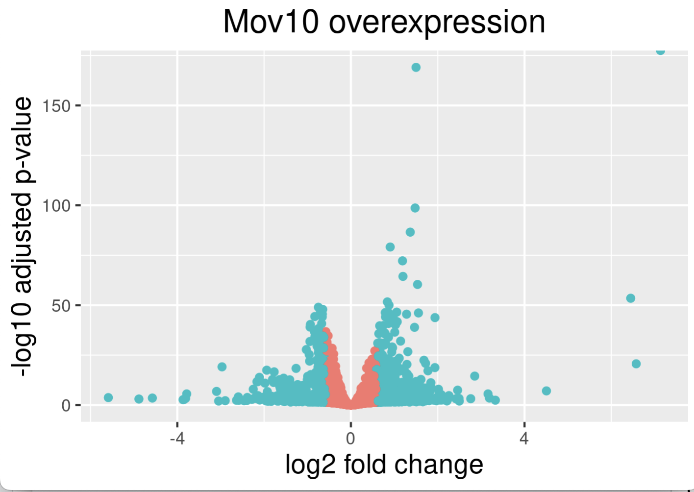
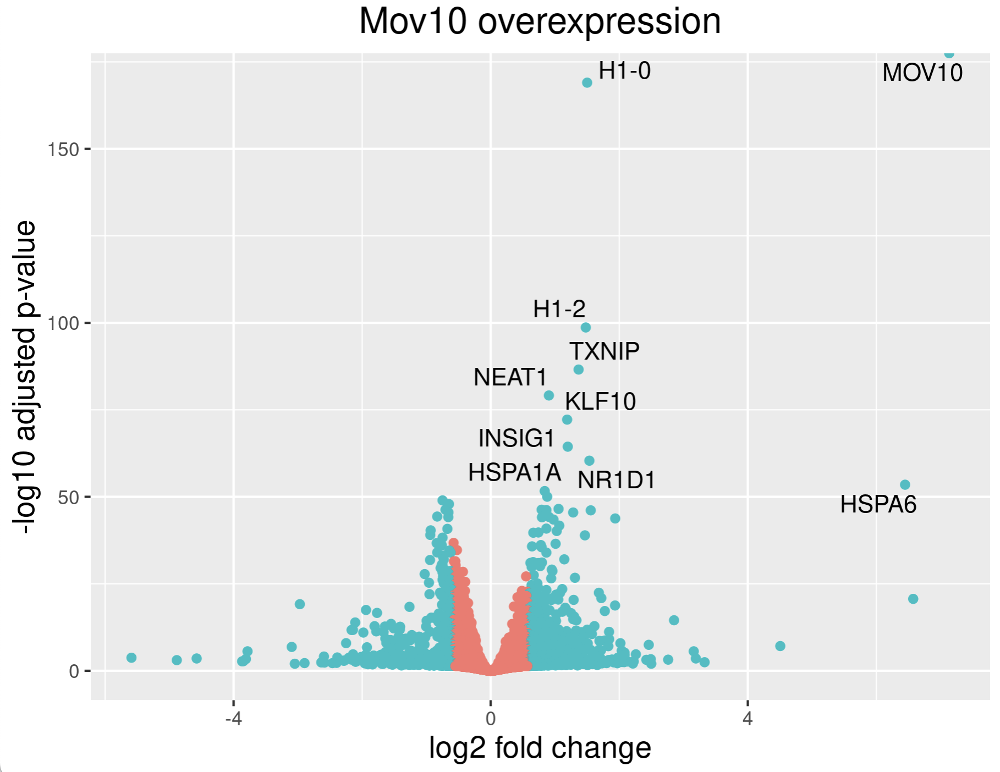

Approximate time: 75 minutes

## Learning Objectives

-   Setup results data for application of visualization techniques
-   Describe different data visualization useful for exploring results from a DGE analysis
-   Create a volcano plot to evaluate relationship amongst DGE statistics
-   Create a heatmap to illustrate expression changes of differentially expressed genes

## Visualizing the results

When we are working with large amounts of data it can be useful to display that information graphically to gain more insight. During this lesson, we will get you started with some basic and more advanced plots commonly used when exploring differential gene expression data, however, many of these plots can be helpful in visualizing other types of data as well.

## Assembling our Data

We will be working with three different data objects we have already created in earlier lessons or will re-create now:

**Metadata for our samples (a dataframe): `meta`**

Create a version of our metadata that moves the rownames to a column called `samplename` because some of the visualization software expects that:

``` r
mov10_meta <- meta %>% 
              rownames_to_column(var="samplename")
```

**GTF info columns:**

If you don't already have this, you can read in the file we created in the last lesson:

``` r
gtf_names <- read.table("/data/Bspc-training/shared/rnaseq_jan2025/downstream_data/gtf_names.txt", header=TRUE)
```

**Normalized count data (matrix):** Normalized expression data for every gene in each of our samples (a matrix): `normalized_counts` . Next, let's bring in a column with gene symbols to the `normalized_counts` object, so we can use them to label our plots. Ensembl IDs are great for many things, but the gene symbols are much more recognizable to us, as biologists

``` r
# DESeq2 creates a matrix when you use the counts() function
## First convert normalized_counts to a data frame and transfer the row names to a new column called "gene"
normalized_counts <- counts(dds, normalized=T) %>% 
                     data.frame() %>%
                     rownames_to_column(var="gene") 

## This will bring in a column of gene symbols and merge by Ensembl gene names
normalized_counts <- merge(normalized_counts, gtf_names, by.x="gene", by.y="ensgene")

#So we don't need to do this again next time, let's write the normalized counts data frame we just created to a file:

write.table(normalized_counts, file="normalized_counts.txt",  col.names = TRUE, row.names = FALSE, quote = FALSE, sep = "\t")
```

**DESeq2 results dataframe:**

If you don't already have this, you can read in the file we created in the last lesson:

``` r
res_tableOE <- read.table("res_tableOE_df.tsv", header=TRUE)
```

## Plotting significant DE genes

One way to visualize results would be to simply plot the expression data for a handful of genes. We could do that by picking out specific genes of interest or selecting a range of genes.

#### **Using DESeq2 `plotCounts()` to plot expression of a single gene**

To pick out a specific gene of interest to plot, for example MOV10, we can use the `plotCounts()` from DESeq2. `plotCounts()` requires that the gene specified matches the original input to DESeq2, which in our case was Ensembl IDs.

``` r
# Find the Ensembl ID of MOV10. Search by Symbol and report back ensembl gene
normalized_counts[normalized_counts$symbol == "MOV10", "ensgene"]

# Plot expression for single gene
plotCounts(dds, gene="ENSG00000155363.19", intgroup="sampletype") 
```



> This DESeq2 function only allows for plotting the counts of a single gene at a time, and is not flexible regarding the appearance.

#### **Using ggplot2 to plot expression of a single gene**

If you wish to change the appearance of this plot, we can save the output of `plotCounts()` to a variable specifying the `returnData=TRUE` argument, then use `ggplot()`:

``` r
# Load ggrepel package which helps space out labels. Be sure to add this to your setup script for the future!
library(ggrepel)

# Save plotcounts to a data frame object
mov10_counts <- plotCounts(dds, gene="ENSG00000155363.19", intgroup="sampletype", returnData=TRUE)

# What is the data output of plotCounts()?
mov10_counts %>% View()

# Plot the MOV10 normalized counts, using the samplenames (rownames(d) as labels)
ggplot(mov10_counts, aes(x = sampletype, y = count, color = sampletype)) + 
    geom_point(position=position_jitter(w = 0.1,h = 0)) +
    geom_text_repel(aes(label = rownames(mov10_counts))) + 
    theme_bw() +
    ggtitle("MOV10") +
    theme(plot.title = element_text(hjust = 0.5))
```

> Note that in the plot below (code above), we are using `geom_text_repel()` from the `ggrepel` package to label our individual points on the plot.



## **ASSIGNMENT**:

Take the above steps (starting with finding the Ensembl Gene ID) for a gene symbol of your choice and create a custom ggplot() of the expression of this gene across our sample types. If you have trouble thinking of a gene symbol, you can check out this [list of symbols for protein-coding genes](https://www.genenames.org/tools/search/#!/?query=&rows=20&start=0&filter=locus_group:%22Protein-coding%20gene%22) from the Human Gene Nomenclature Consortium.

**Be sure to export your image as a .PNG file and to save the lines of customized code you used in an R Script!**

### Heatmap

In addition to plotting subsets, we could also extract the normalized values of *all* the significant genes and plot a heatmap of their expression using `pheatmap()`. Remember that `sig0E` is a data object from the previous lessons.

``` r
### If you need to regenerate sigOE
# Subset the tibble to keep only significant genes 
sigOE <- res_tableOE_tb %>%
  dplyr::filter(padj < 0.05)
```

``` r
### Extract normalized expression for significant genes from the OE and control samples (2:4 and 7:9)
norm_OEsig <- normalized_counts[,c(1:4,7:9)] %>% 
              dplyr::filter(gene %in% sigOE$gene)  
```

Now let's draw the heatmap using `pheatmap`:

``` r
### Set a color palette
heat_colors <- brewer.pal(6, "YlOrRd")

### Run pheatmap using the metadata data frame for the annotation
pheatmap(norm_OEsig[2:7], 
    color = heat_colors, 
    cluster_rows = T, 
    show_rownames = F,
    annotation = meta, 
    border_color = NA, 
    fontsize = 10, 
    scale = "row", 
    fontsize_row = 10, 
    height = 20)
```



> *NOTE:* There are several additional arguments we have included in the function for aesthetics. One important one is `scale="row"`, in which Z-scores are plotted, rather than the actual normalized count value.
>
> Z-scores are computed on a gene-by-gene basis by subtracting the mean and then dividing by the standard deviation. The Z-scores are computed **after the clustering**, so that it only affects the graphical aesthetics and the color visualization is improved.

### Volcano plot

The above plot would be great to look at the expression levels of a good number of genes, but for more of a global view there are other plots we can draw. A commonly used one is a volcano plot; in which you have the log transformed adjusted p-values plotted on the y-axis and log2 fold change values on the x-axis.

To generate a volcano plot, we first need to have a column in our results data indicating whether or not the gene is considered differentially expressed based on p-adjusted values and we will include a log2fold change here.

``` r
## Obtain logical vector where TRUE values denote padj values < 0.05 and fold change > 1.5 in either direction

res_tableOE_tb <- res_tableOE_tb %>% 
                  dplyr::mutate(threshold_OE = padj < 0.05 & abs(log2FoldChange) >= 0.58)
```

Now we can start plotting. The `geom_point` object is most applicable, as this is essentially a scatter plot:

``` r
## Volcano plot
ggplot(res_tableOE_tb) +
    geom_point(aes(x = log2FoldChange, y = -log10(padj), colour = threshold_OE)) +
    ggtitle("Mov10 overexpression") +
    xlab("log2 fold change") + 
    ylab("-log10 adjusted p-value") +
    #scale_y_continuous(limits = c(0,50)) +
    theme(legend.position = "none",
          plot.title = element_text(size = rel(1.5), hjust = 0.5),
          axis.title = element_text(size = rel(1.25)))  
```



This is a great way to get an overall picture of what is going on, but what if we also wanted to know where the top 10 genes (lowest padj) in our DE list are located on this plot? We could label those dots with the gene name on the Volcano plot using `geom_text_repel()`.

First, we need to order the res_tableOE tibble by `padj`, and add an additional column to it, to include on those gene names we want to use to label the plot.

``` r
## Add all the gene symbols as a column from the gtf_names table using bind_cols()
res_tableOE_tb <- bind_cols(res_tableOE_tb, symbol=gtf_names$symbol[match(res_tableOE_tb$gene, gtf_names$ensgene)])

## Create an empty column to indicate which genes to label
res_tableOE_tb <- res_tableOE_tb %>% dplyr::mutate(genelabels = "")

## Sort by padj values 
res_tableOE_tb <- res_tableOE_tb %>% dplyr::arrange(padj)

## Populate the genelabels column with contents of the gene symbols column for the first 10 rows, i.e. the top 10 most significantly expressed genes
res_tableOE_tb$genelabels[1:10] <- as.character(res_tableOE_tb$symbol[1:10])

View(res_tableOE_tb)
```

Next, we plot it as before with an additional layer for `geom_text_repel()` wherein we can specify the column of gene labels we just created.

``` r
ggplot(res_tableOE_tb, aes(x = log2FoldChange, y = -log10(padj))) +
    geom_point(aes(colour = threshold_OE)) +
    geom_text_repel(aes(label = genelabels)) +
    ggtitle("Mov10 overexpression") +
    xlab("log2 fold change") + 
    ylab("-log10 adjusted p-value") +
    theme(legend.position = "none",
          plot.title = element_text(size = rel(1.5), hjust = 0.5),
          axis.title = element_text(size = rel(1.25))) 
```



------------------------------------------------------------------------

> ### An R package for visualization of DGE results
>
> The Bioconductor package [`DEGreport`](https://bioconductor.org/packages/release/bioc/html/DEGreport.html) can use the DESeq2 results output to make the top20 genes and the volcano plots generated above by writing much fewer lines of code. The caveat of these functions is you lose the ability to customize plots as we have demonstrated above.
>
> If you are interested, the example code below shows how you can use DEGreport to create similar plots. **Note that this is example code, do not run.**
>
> ``` r
> ## load degreport
> library(degreport)
> ```

> ``` r
> DEGreport::degPlot(dds = dds, res = res, n = 20, xs = "type", group = "condition") # dds object is output from DESeq2
>
> DEGreport::degVolcano(
>     data.frame(res[,c("log2FoldChange","padj")]), # table - 2 columns
>     plot_text = data.frame(res[1:10,c("log2FoldChange","padj","id")])) # table to add names
>
> DEGreport::degPlotWide(dds = dds, genes = row.names(res)[1:5], group = "condition")
> ```

------------------------------------------------------------------------

*This lesson has been developed by members of the teaching team at the [Harvard Chan Bioinformatics Core (HBC)](http://bioinformatics.sph.harvard.edu/). These are open access materials distributed under the terms of the [Creative Commons Attribution license](https://creativecommons.org/licenses/by/4.0/) (CC BY 4.0), which permits unrestricted use, distribution, and reproduction in any medium, provided the original author and source are credited.*
