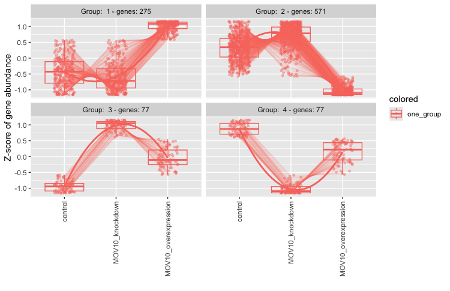
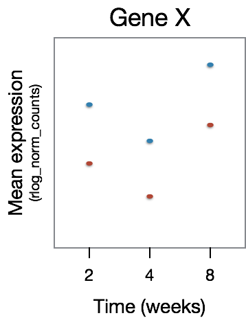
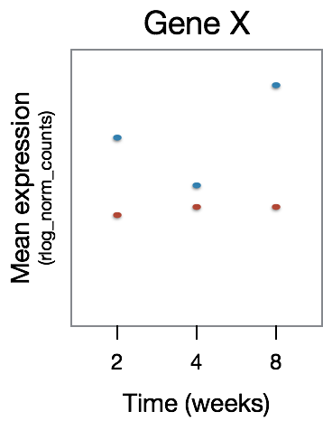

Approximate time: 60 minutes

## Learning Objectives

-   Apply the Likelihood Ratio Test (LRT) for hypothesis testing
-   Compare results generated from the LRT to results obtained using the Wald test
-   Identify shared expression profiles from the LRT significant gene list

## Exploring results from the Likelihood ratio test (LRT)

DESeq2 also offers the Likelihood Ratio Test as an alternative **when evaluating expression change across more than two levels**. Genes which are identified as significant, are those that are changing in expression in any direction across the different factor levels.

Generally, this test will result in a larger number of genes than the individual pair-wise comparisons. While the LRT is a test of significance for differences of any level(s) of the factor, one should not expect it to be exactly equal to the union of sets of genes using Wald tests (although we do expect a high degree of overlap).

## Catch-Up Script

You need to have the `res_tableOE` object in your environment. If you need to be completely caught up, you can copy and paste the following into an R Script and run it. If you don't already have the files in your `/data` directory, please see [Wk 5 Lesson 01](../wk5_lesson01_introR_Rstudio.md) for instructions on where to obtain the input files.

Remember to get your HPC On Demand session going, if applicable, and open your `DEAnalysis` R project!

``` r
# Setup
# Bioconductor and CRAN libraries used - already installed on Biowulf
library(tidyverse)
library(RColorBrewer)
library(DESeq2)
library(pheatmap)
library(BiocManager)

# Load in data
data <- read.table("data/mov10_AllSamples_featurecounts.Rmatrix.txt", header=T, row.names=1)

meta <- read.table("data/mov10_AllSamples_metadata.txt", header=T, row.names=1)

# Create DESeq2Dataset object
dds <- DESeqDataSetFromMatrix(countData = data, colData = meta, design = ~ sampletype) 

# Run DESeq2 on DESeq2Dataset object
dds <- DESeq(dds)

# Likelihood ratio test
dds_lrt <- DESeq(dds, test="LRT", reduced = ~ 1)

## Define overexpression vs. control contrast for Wald Test
contrast_oe <- c("sampletype", "MOV10_overexpression", "control")

## Extract results for MOV10 overexpression vs control
res_tableOE <- results(dds, contrast=contrast_oe)

#Set up control vs. OE contrast
contrast_oe <- c("sampletype", "MOV10_overexpression", "control")
res_tableOE <- results(dds, contrast=contrast_oe, alpha = 0.1)

#LFC shrinking
res_tableOE_unshrunken <- res_tableOE
res_tableOE <- lfcShrink(dds, coef="sampletype_MOV10_overexpression_vs_control", type="apeglm")

### Set thresholds
padj.cutoff <- 0.1

#formatting res_OE_df 
res_OE_df <- rownames_to_column(data.frame(res_tableOE), var="gene")

#import relevant parts of GTF file
gtf_names <- read.table("/data/Bspc-training/shared/rnaseq_mov10/downstream_data/gtf_names.txt", header=TRUE)

#merge gene symbols
res_OE_df <- merge(gtf_names,res_OE_df, by.x="ensgene", by.y="gene")

# Subset the dataframe to keep only significant genes 
sigOE <- res_OE_df[res_OE_df$padj < padj.cutoff,]
```

## The `results()` table

To extract the results from our `dds_lrt` object we can use the same `results()` function we had used with the Wald test. *There is no need for contrasts since we are not making a pair-wise comparison.*

``` r
# Extract results for LRT
res_LRT <- results(dds_lrt)
```

Let's take a look at the results table:

``` r
# View results for LRT
res_LRT  
```

```         
log2 fold change (MLE): sampletype MOV10 overexpression vs control 
LRT p-value: '~ sampletype' vs '~ 1' 
DataFrame with 78932 rows and 6 columns
                   baseMean log2FoldChange     lfcSE      stat
                  <numeric>      <numeric> <numeric> <numeric>
ENSG00000290825.2  0.323042       0.877124  3.337510  0.358728
ENSG00000223972.6  0.000000             NA        NA        NA
ENSG00000310526.1 88.634809       0.108432  0.197132  0.857979
ENSG00000227232.6  0.000000             NA        NA        NA
ENSG00000278267.1  0.000000             NA        NA        NA
...                     ...            ...       ...       ...
ENSG00000303867.1   0.00000             NA        NA        NA
ENSG00000303902.1   0.00000             NA        NA        NA
ENSG00000306528.1   0.00000             NA        NA        NA
ENSG00000297844.1   0.00000             NA        NA        NA
ENSG00000309258.1   7.00007       -2.20108  0.846886   10.3397
                      pvalue      padj
                   <numeric> <numeric>
ENSG00000290825.2   0.835801        NA
ENSG00000223972.6         NA        NA
ENSG00000310526.1   0.651167  0.772761
ENSG00000227232.6         NA        NA
ENSG00000278267.1         NA        NA
...                      ...       ...
ENSG00000303867.1         NA        NA
ENSG00000303902.1         NA        NA
ENSG00000306528.1         NA        NA
ENSG00000297844.1         NA        NA
ENSG00000309258.1 0.00568548 0.0153827
```

The results table output looks similar to the Wald test results, with identical columns to what we observed previously.

### Why are fold changes reported for an LRT test?

For analyses using the likelihood ratio test, the p-values are determined solely by the difference in deviance between the full and reduced model formula. **A single log2 fold change is printed in the results table for consistency with other results table outputs, but is not associated with the actual test. You should ignore this column in results from LRT.**

**Columns relevant to the LRT test:**

-   `baseMean`: mean of normalized counts for all samples
-   `stat`: the difference in deviance between the reduced model and the full model
-   `pvalue`: the stat value is compared to a chi-squared distribution to generate a pvalue
-   `padj`: BH adjusted p-values

**Additional columns:**

-   `log2FoldChange`: log2 fold change
-   `lfcSE`: standard error

> **NOTE:** Printed at the top of the the results table are the two sample groups used to generate the log2 fold change values that we observe in the results table. This can be controlled using the `name` argument; the value provided to name must be an element of resultsNames(dds).

## Identifying significant genes

When filtering significant genes from the LRT we put a threshold only the `padj` column. *How many genes are significant at default p-adj of 0.1?*

``` r
# set up cutoff to match DEseq2 and BSPC default
padj.cutoff <- 0.1

# Create a data frame of these results
res_LRT_df <- res_LRT %>%
  data.frame() %>%
  rownames_to_column(var="gene")

# You probably want to also have those gene symbols attached
res_LRT_df <- merge(gtf_names,res_LRT_df, by.x="ensgene", by.y="gene") 

# Check out what this looks like with `head()`
head(res_LRT_df)

# And now you can write this out for further analysis!
write.table(res_LRT_df,"res_LRT_df.tsv", sep="\t", row.names=FALSE, col.names=TRUE,quote=FALSE)
```

``` r
# Subset to return genes with padj < 0.1 
sigLRT_genes <- res_LRT_df %>% 
  dplyr::filter(padj < padj.cutoff)

# Get number of significant genes
nrow(sigLRT_genes)

# Compare to numbers we had from Wald test
nrow(sigOE)
```

This list includes genes that can be changing in any direction across the three factor levels (control, KO, overexpression). To reduce the size of this list (for processing reasons etc.) we can increase the stringency of our FDR threshold (`padj.cutoff`), or subset the top most differentially expressed genes (see below).

------------------------------------------------------------------------

**In-Class Demo:**

1.  Compare the resulting gene list from the LRT test to the gene lists from the Wald test comparisons.
    1.  How many of the `sigLRT_genes` overlap with the significant genes in `sigOE`?

        ``` r
        ## But this just prints it out, we want to count 
        intersect(sigLRT_genes$symbol, sigOE$symbol)

        ## count the number of elements
        length(intersect(sigLRT_genes$symbol, sigOE$symbol))
        ```

    2.  How many of the `sigLRT_genes` overlap with the significant genes in `sigKD`?

------------------------------------------------------------------------

## Identifying clusters of genes with shared expression profiles

We now have this list of \~7K significant genes that we know are changing in some way across the three different sample groups. What do we do next?

A good next step is to identify groups of genes that share a pattern of expression change across the sample groups (levels). To do this we will be using a clustering tool called `degPatterns` from the 'DEGreport' package. The `degPatterns` tool uses a **hierarchical clustering approach based on pair-wise correlations** between genes, then cuts the hierarchical tree to generate groups of genes with similar expression profiles. The tool cuts the tree in a way to optimize the diversity of the clusters, such that the variability inter-cluster \> the variability intra-cluster.

Before we begin clustering, we will **first subset our rlog transformed normalized counts** to retain only the differentially expressed genes (padj \< 0.1).

In our case, it may take some time to run the clustering on the thousands of significant genes, and so for class demonstration purposes we will subset to keep only the top 1000 genes sorted by p-adjusted value.

> #### Where do I get rlog transformed counts?
>
> This rlog transformation was applied in an [earlier lesson](03_DGE_QC_analysis.md#transform-normalized-counts-for-the-mov10-dataset) when we performed QC analysis. If you **do not see this in your environment**, run the following code:
>
> ```         
> ### Transform counts for data visualization
> rld <- rlog(dds, blind=TRUE)
> rld_mat <- assay(rld)
> ```

``` r
# Subset results to top 1000 for faster cluster finding (for classroom demo purposes)
clustering_sig_genes <- sigLRT_genes %>%
  arrange(padj) %>%
  head(n=1000)

# Obtain rlog values for those significant genes
cluster_rlog <- rld_mat[clustering_sig_genes$ensgene, ]
```

The rlog transformed counts for the significant genes are input to `degPatterns` along with a few additional arguments:

-   `metadata`: the metadata dataframe that corresponds to samples
-   `time`: character column name in metadata that will be used as variable that changes. Does not necessarily need to be actually `time`.
-   `col`: character column name in metadata to separate samples

``` r
# Use the `degPatterns` function from the 'DEGreport' package to show gene clusters across sample groups

#degpatterns expects our meta variables to be factors, not characters
meta$sampletype = as.factor(meta$sampletype)
clusters <- degPatterns(cluster_rlog, metadata = meta, time = "sampletype", col= NULL)
```

Once the clustering is finished running, you will get your command prompt back in the console and you should see a figure appear in your plot window. The genes have been clustered into four different groups. For each group of genes, we have a boxplot illustrating expression change across the different sample groups. A line graph is overlayed to illustrate the trend in expression change.

<p align="center">



</p>

Suppose we are interested in the genes which show a decreased expression in the knockdown samples and increase in the overexpression. The closest pattern to this might group 1, with 275 genes. However it's important to note that **the clusters do not have statistical significance.**. That is, just because the pattern seems to have a shape where MOV10 knockdown looks to be less, this does NOT mean that these genes have signficantly decreased expression in MOV10 relative to control. To know that, we'd need to inspect the contrast that specifically compares those two conditions.

But that cluster still seems interesting, so let's explore the output to see what genes those are. What type of data structure is the `clusters` output?

``` r
# What type of data structure is the `clusters` output?
class(clusters)
```

We can see what objects are stored in the list by using `names(clusters)`. There is a dataframe stored inside. This is the main result so let's take a look at it. The first column contains the genes, and the second column contains the cluster number to which they belong.

``` r
# Let's see what is stored in the `df` component
head(clusters$df)
```

Since we are interested in Group 1, we can filter the dataframe to keep only those genes:

``` r
# Extract the Group 1 genes
group1 <- clusters$df %>%
          dplyr::filter(cluster == 1)
```

After extracting a group of genes, we can also re-attach the `gene symbols` and use annotation packages to obtain additional information. We can also use these lists of genes as input to downstream functional analysis tools to obtain more biological insight and see whether the groups of genes share a specific function.

## Time course analyses with LRT

Despite the popularity of static measurement of gene expression, time-course capturing of biological processes is essential to reflect their dynamic nature, particularly when patterns are complex and are not simply ascending or descending. When working with this type of data, the Likelihood Ratio Test (LRT) is especially helpful. We can use the LRT to explore whether there are any significant differences across a series of timepoints and further evaluate differences observed between sample classes.

For example, suppose we have an experiment looking at the effect of treatment over time on mice of two different genotypes. We could use a design formula for our 'full model' that would include the major sources of variation in our data: `genotype`, `treatment`, `time`, and our main condition of interest, which is the difference in the effect of treatment over time (`treatment:time`).

> **NOTE:** This is just example code for our hypothetical experiment. You **should not run this code**.

``` r
## DO NOT RUN

full_model <- ~ genotype + treatment + time + treatment:time
```

To perform the LRT test, we also need to provide a reduced model, that is the full model without the `treatment:time` term:

``` r
## DO NOT RUN

reduced_model <- ~ genotype + treatment + time
```

Then, we could run the LRT by using the following code:

``` r
## DO NOT RUN

dds <- DESeqDataSetFromMatrix(countData = raw_counts, colData = metadata, design = ~ genotype + treatment + time + treatment:time)

dds_lrt_time <- DESeq(dds, test="LRT", reduced = ~ genotype + treatment + time)
```

To understand what kind of gene expression patterns will be identified as differentially expressed, we have a few examples below. In the plots below we have Time on the x-axis and gene expression on the y-axis. In this dataset there are two samples for each time point, one having undergone some treatment (red) and the other without (blue).

For this figure, we are depicting the type of **genes that will not be identified as differentially expressed.** Here, we observe that GeneX is differentially expressed between the time points, however there is no difference in that expression pattern between the treatment groups.

<p align="center">



</p>

The type of **gene expression patterns we do expect** the LRT to return are those that exhibit differences in the effect of treatment over time. In the example below, GeneX displays a different expression pattern over time for the two treatment groups.

<p align="center">



</p>

Continuing with our example dataset, after running the LRT we can determine the set of significant genes using a threshold of `padj` \< 0.05. The next step would be to sort those genes into groups based on shared expression patterns, and we could do this using `degPatterns()`. Here, you will notice that we make use of the `col` argument since we have two groups that we are comparing to one another.

``` r
clusters <- degPatterns(cluster_rlog, metadata = meta, time="time", col="treatment")
```

Depending on what type of shared expression profiles exist in your data, you can then extract the groups of genes associated with the patterns of interest and move on to functional analysis for each of the gene groups of interest.

------------------------------------------------------------------------

*This lesson has been developed by members of the teaching team at the [Harvard Chan Bioinformatics Core (HBC)](http://bioinformatics.sph.harvard.edu/). These are open access materials distributed under the terms of the [Creative Commons Attribution license](https://creativecommons.org/licenses/by/4.0/) (CC BY 4.0), which permits unrestricted use, distribution, and reproduction in any medium, provided the original author and source are credited.*

-   *Materials and hands-on activities were adapted from [RNA-seq workflow](http://www.bioconductor.org/help/workflows/rnaseqGene/#de) on the Bioconductor website*
